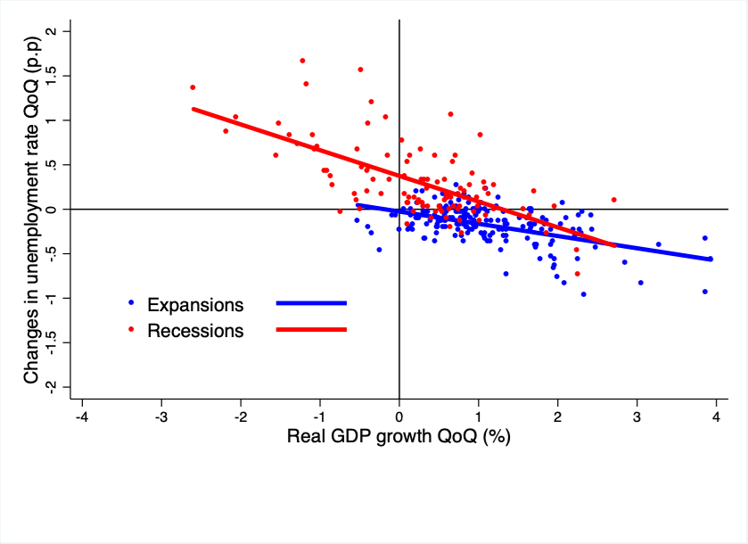

Welcome! I am a Ph.D. Candidate in Economics at the <a href="https://lsa.umich.edu/econ/doctoral-program.html" target="_blank"> University of Michigan </a>. I am on the 2023-2024 Economics job market. You can contact me at <a href = "mailto: nadime@umich.edu">nadime@umich.edu</a>. 

Field: Macroeconomics.

Secondary Fields: International Economics and Labor Economics.

Before moving to the home of the Wolverines to start the Ph.D. I worked as an intern at the research department of <a href="https://www.caixabankresearch.com/en" target="_blank"> CaixaBank </a> and as a research assistant at <a href="https://www.iese.edu/" target="_blank"> IESE Business School </a> in Barcelona. 

EDUCATION
======

- Ph.D. in Economics (Expected 2024)
  - <a href="https://lsa.umich.edu/econ/doctoral-program.html" target="_blank"> University of Michigan </a> 

- M.A. in Economics (2019)
  - <a href="https://lsa.umich.edu/econ/doctoral-program.html" target="_blank"> University of Michigan </a> 

- M.Sc. in International Trade, Finance and Development (2015)
  - <a href="https://bse.eu/" target="_blank"> Barcelona School of Economics </a> 

- B.A. in Economics (2014)
  - <a href="https://www.upf.edu/" target="_blank"> Universitat Pompeu Fabra </a> 

RESEARCH: WORKING PAPERS
======

- **Strategic or scarred? Disparities in college enrollment and dropout response to macroeconomic conditions. [Job Market Paper] <a href="https://drive.google.com/uc?export=download&id=1w2fmktsDQWks6DhQtxBagb8_3Vbr82pM" target="_blank"> Download here </a>**

Recessions might create enduring scars on young individuals, notably during critical periods such as high school graduation and college enrollment. I investigate how educational choices amplify or mitigate these scarring effects across income levels. Low-income individuals face dual impacts from recession scars: increased likelihood of dropping out while enrolled, and enduring negative labor market entry effects. Conversely, high-income individuals strategically evade these repercussions, delaying labor market entry through timely college enrollment during economic downturns. Employing a dynamic model, I quantify the lifetime repercussions of experiencing a recession during these critical phases. The poorest individuals endure a 40% reduction in lifetime consumption if a recession occurs while they are enrolled in college. A recession that occurs around the time of high school graduation predominantly affects the middle-low income group, hindering their college attendance, resulting in a 24% lifetime consumption loss. High-income individuals exhibit resilience to these economic fluctuations.

- **State dependent Okun's law: A selective labor hoarding approach**

In this paper I show that Okun's Law, the relationship between changes in the unemployment rate and real GDP, is state dependent: the relationship is stronger during recessions. I hypothesize that firms engaging in selective labor hoarding can explain this state dependency. If firms hoard high-skilled workers outside of recessions to economize on training costs Okun's law will be relatively flat in those times. Such labor hoarding becomes untenable during recessions, which results in a nonlinear response of unemployment. I build a dynamic model of directed search with heterogeneous firms, endogenous exit and training costs that is able to generate the nonlinear response of unemployment to changes in real GDP.

- **Global Supply Chains and regional shocks** *with Jose Ramon Moran*

This paper explores how regional shocks affect the formation of global supply chains, recognizing the trade-off firms face when choosing the sourcing location of their inputs. On the one hand, sourcing from similar countries entails a lower risk of being exposed to regional shocks but on the other, it implies firms are less able to take advantage of the pattern of comparative advantage across the World. Using customs data on Mexican firms we document how firms weigh this trade-off, whether there is sectoral heterogeneity in this behavior, and study whether this heterogeneity is the result of sector-specific input complementarity. We build a model of global sourcing that accounts for comparative advantage being driven by geographical location and exposure to regional shocks. With our model, we explore the effects that an episode of increased regional risk, namely the COVID-19 global pandemic, had on firms’ global supply chain formation.

